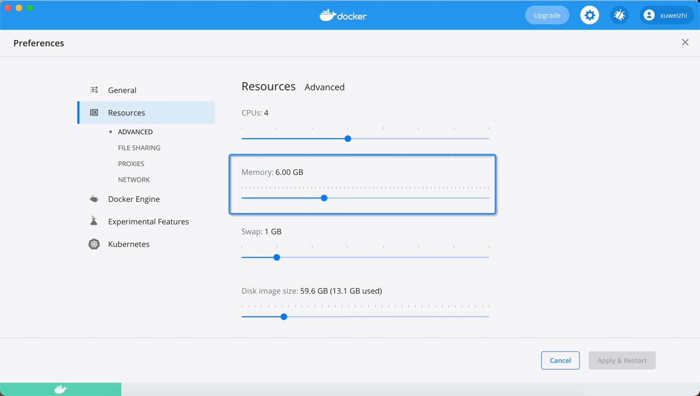

### 特别注意事项，Docker Desktop 用户需要设置内存

如果内存过小，会导致应用一直重启

### 准备事项

容器挂载路径均设为 777 权限，容易与宿主机之间容易造成权限不足的情况,不同版本的容器镜像请删除之前容器的数据。

防火墙要关闭：

    systemctl unmask firewalld                      #执行命令，即可实现取消服务的锁定
    systemctl mask firewalld                        #下次需要锁定该服务时执行
    systemctl start firewalld.service               #启动防火墙  
    systemctl stop firewalld.service                #停止防火墙  
    systemctl reloadt firewalld.service             #重载配置
    systemctl restart firewalld.service             #重启服务
    systemctl status firewalld.service              #显示服务的状态
    systemctl enable firewalld.service              #在开机时启用服务
    systemctl disable firewalld.service             #在开机时禁用服务
    systemctl is-enabled firewalld.service          #查看服务是否开机启动
    systemctl list-unit-files|grep enabled          #查看已启动的服务列表
    systemctl --failed                              #查看启动失败的服务列表

修改 mysql 8.0 不能访问的问题

    # 进入 Mysql 容器,bash并进入mysql命令行
    docker exec -it mysql bash
    
    # 登录 Mysql
    mysql -uroot -proot
    
    //使用mysql数据库
    use mysql
    
    //修改加密方式
    ALTER USER 'root'@'%' IDENTIFIED WITH mysql_native_password BY 'root';
    
    //重新修改密码后可连接成功
    alter  user 'root'@'%' identified by 'root';
    
    //刷新数据库
    flush privileges;

### 调高JVM线程数限制数量

    在centos窗口中，修改配置sysctl.conf
    
    vi /etc/sysctl.conf
    加入如下内容：
    
    vm.max_map_count=262144
    启用配置：
    
    sysctl -p

## 打开Window 10 的CMD

执行以下命令：

    wsl -d docker-desktop
    echo 262144 >> /proc/sys/vm/max_map_count

通过这个方法，即使操作系统重启，参数仍然有效。

# x-pack

进入 elasticsearch 容器

    # 随机生成密码
    ./bin/elasticsearch-setup-passwords auto
    
    # 生成指定指定密码
    ./bin/elasticsearch-setup-passwords interactive

# es-header 

启动后访问 password 和密码指定
 
    http://localhost:9100/?auth_user=elastic&auth_password=elastic

# docker-compose 变量引用

https://www.jianshu.com/p/b63f828e92ba

- environment: 直接引用 .env key 
- other: ${key}

docker-compose config  查看修改后的参数

# skywalking 

agent 下载

    https://skywalking.apache.org/downloads/

启动命令追加

    -javaagent:/Users/xuweizhi/Documents/projects/docker-container/skywalking-agent/skywalking-agent.jar
    -Dskywalking.agent.service_name=study_logback
    -Dskywalking.collector.backend_service=127.0.0.1:11800

